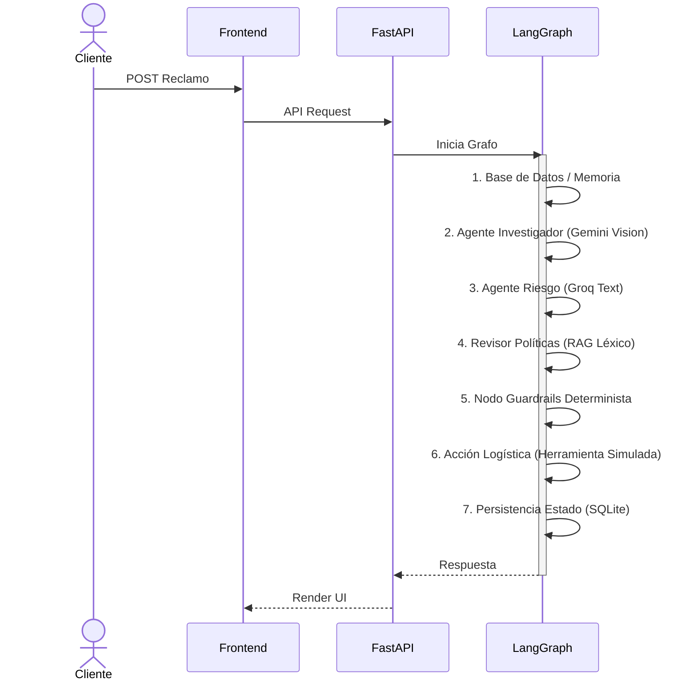

# Universidad Tecnológica Nacional · FRBA
## EPIData · Especialización en Inteligencia Artificial Aplicada a Organizaciones

# 🤖 E-COM AGENT
**Orquestación Agéntica Multi-Modelo, Memoria Persistente y Decisiones Explicables en Postventa Inteligente**

**Trabajo:** Proyecto Final de Ciclo — Entrega Final
**Autor / Alumno:** Nicolás J. Alancay Albelo
**Fecha de Presentación:** Agosto 2026
**Formato de Evaluación:** Implementación y Video de Demostración

---

### 📍 LINKS DIRECTOS DEL PROYECTO EN PRODUCCIÓN
* 🌐 **Frontend UI:** [ecom-agent-frontend-woad.vercel.app](https://ecom-agent-frontend-woad.vercel.app)
* ⚙️ **Backend API:** [ecom-agent-backend.vercel.app](https://ecom-agent-backend.vercel.app)
* 📦 **Repo Backend:** [github.com/nalancay17/ecom-agent-backend](https://github.com/nalancay17/ecom-agent-backend)
* 🖥️ **Repo Frontend:** [github.com/nalancay17/ecom-agent-frontend](https://github.com/nalancay17/ecom-agent-frontend)
* 🎥 **Video Demo:** [Ver en Google Drive](https://drive.google.com/file/d/1CMw5ksuJKoXbSfBc0NDPdnOtLc-zUa4j/view?usp=sharing)

---

## PARTE 1 — El Proyecto como Aplicación Real

### Sección 1: Presentación del Equipo y del Proyecto

**1.1 Integrantes del Grupo y Roles Co-Work**
* **Nicolás J. Alancay Albelo** — *Desarrollador Full-Stack & Arquitecto de Inteligencia Artificial*: Responsable del diseño arquitectónico, bases de datos relacionales, backend agéntico con LangGraph y FastAPI, interfaz web de usuario (HTML5 + Vanilla JS + Vite), integración de APIs multi-modelo (Google Gemini & Groq Cloud), pruebas de usabilidad, despliegue en Vercel y documentación.

**1.2 Nombre del Proyecto**
**E-Com Agent**: Sistema Inteligente y Multi-Agente de Postventa y Gestión de Devoluciones de E-commerce.

**1.3 Problema que Resuelve**
En el comercio electrónico actual, el proceso de postventa de tiendas medianas sufre de tres fricciones críticas:
* **Ingesta ineficiente:** Solicitudes en lenguaje natural y fotografías de calidad variable obligan a la revisión manual.
* **Cuellos de botella humanos:** Equipos de atención al cliente sobrecargados con tareas repetitivas incrementando el TTR (Time to Resolve).
* **Vulnerabilidad e Inconsistencia:** Ausencia de análisis visual sistemático, propiciando decisiones inconsistentes o resoluciones favorables a reclamos fraudulentos.

**1.4 Propuesta de Valor y Solución Implementada**
**E-Com Agent** automatiza de manera integral y auditable el procesamiento de reclamos. Las decisiones clave tomadas incluyen:
* **Restricción de Canales de Entrada:** Ingesta limitada a formato Web e Imagen estructurada para asegurar auditabilidad.
* **Inspección Visual Multimodal:** Utilización de modelos fundacionales de visión para correlacionar la narrativa del cliente con la evidencia empírica fotográfica.
* **Anclaje Semántico Local:** Validación directa contra las políticas de la empresa mediante un motor de recuperación documental.
* **Autonomía Escalada (33,3% observable inicial):** Resolución autónoma para reclamos confiables y de baja cuantía, reservando el procesamiento humano de casos complejos (HITL).

**1.5 Público Objetivo**
* **Clientes Finales (B2C):** Usuarios que exigen resoluciones transparentes y ágiles para gestionar envíos logísticos inversos sin demoras.
* **Supervisores (B2B):** Operadores de backoffice que gestionan excepciones complejas guiados por trazas de auditoría.

---

### Sección 2: Arquitectura Técnica y Resoluciones Agénticas

**2.1 Diagrama de Arquitectura y Orquestación**
La implementación final utiliza un orquestador **StateGraph de LangGraph** con un flujo secuencial de agentes y ramificaciones condicionales en los puntos de validación. Este patrón permite derivar casos a la cola HITL o finalizar anticipadamente ante inconsistencias, garantizando la inmutabilidad de los flujos del negocio.


**2.2 Diagrama UML de Secuencia**
El siguiente diagrama detalla las interacciones síncronas y asíncronas del sistema completo en el procesamiento de un reclamo:



**2.3 Caja Negra: Fórmula del Score de Confianza Compuesto**
El sistema toma decisiones en base a una métrica determinista extraída de las inferencias subyacentes. El score compuesto se calcula ponderando matemáticamente cuatro señales en el código base:

$$Composite\_Score = 0.35 \times C_{vision} + 0.35 \times C_{politica} + 0.20 \times (1 - R_{fraude}) + 0.10 \times T_{cliente}$$

* **$C_{vision}$ (35%):** Confianza semántica y de correspondencia visual provista por el modelo.
* **$C_{politica}$ (35%):** Validación de la aplicabilidad temporal y funcional frente a las reglas (RAG).
* **$(1 - R_{fraude})$ (20%):** Ponderación inversa del riesgo probabilístico calculado sobre el usuario.
* **$T_{cliente}$ (10%):** Trust score o fidelidad de la cuenta extraído desde la DB en el nodo inicial.

> **Umbral de Autonomía:** La autoaprobación (`APPROVED_AUTO`) se habilita únicamente cuando el score es igual o superior a **0.65** y no se activa ningún guardrail duro de la empresa (como un monto superior a $100.000).

**2.4 Agente de Riesgo (Risk Evaluator)**
Se desarrolló un evaluador explícito para mitigar el sesgo y falsos positivos al detectar fraude. 
* **Criterios Directos:** Historial de reclamos (últimos 90 días), trust score, monto, categoría del producto y tier del cliente.
* **Mitigación VIP:** Clientes con alto Trust Score pero con reclamo inicial son ponderados de forma más empática.

**2.5 Búsqueda de Memoria Semántica (RAG)**
Se implementó un motor de recuperación documental local programado nativamente en Python. Se realiza el *chunking* por artículos del manual y se ejecuta un ranking léxico de similitud (sobre tokens normalizados). Los fragmentos se inyectan como contexto riguroso en el prompt del agente revisor.

**2.6 Persistencia y Evolución (Aprendizaje Continuo)**
El sistema registra resoluciones humanas y autónomas en la memoria episódica. Este dataset servirá para un futuro ajuste de pesos y calibración, mientras que las reglas duras (guardrails) permanecen en código condicional estándar.

**2.7 Agente Ejecutor y Gestión de Evidencia**
Si el orquestador dictamina aprobación, el Agente Ejecutor (herramienta logística simulada) genera el *tracking*. Por el contrario, si la evidencia es de baja calidad visual, el sistema interrumpe el curso y envía el reclamo a `PENDING_HITL_EVIDENCE_QUALITY` para su gestión manual.

---

### Sección 3: Stack Tecnológico (Implementación Real)

| Capa | Tecnología / Herramienta | Justificación Técnica de Elección |
| :--- | :--- | :--- |
| **Frontend Web** | HTML5 + Vanilla JS + Vite | Despliegue ultraligero y manipulación limpia del DOM. |
| **Backend API** | Python 3.11 + FastAPI | Framework asíncrono con validación Pydantic estricta. |
| **Orquestación** | LangGraph (StateGraph) | Manejo del estado conversacional en un único objeto, con control secuencial. |
| **Memoria Semántica** | Motor Léxico Local | Recuperación documental directa sin depender de librerías vectoriales de terceros. |
| **Modelos IA** | Gemini 3.6 Flash / Groq Cloud | Gemini para análisis multimodal, y procesadores Groq para razonamiento rápido. |
| **Infraestructura** | Vercel (Serverless Functions) | Paso del código local a la nube de manera fluida (MVP). |

---

### Sección 4: Evidencias de Funcionamiento y Datos Reales

**4.1 Casos de Prueba Iniciales**
| # | Pedido | Producto | Monto | Resultado Teórico |
| :--- | :--- | :--- | :--- | :--- |
| 1 | ORD-1002 | Auriculares | $45.000 | **APROBADO AUTÓNOMO** (Score adecuado) |
| 2 | ORD-1001 | Monitor | $180.000 | **HITL** (Supera restricción estricta de $100k) |
| 3 | ORD-1003 | Bóxer | $12.500 | **RECHAZO DIRECTO** (Categoría bloqueada) |
| 4 | ORD-1005 | Smartwatch | $35.000 | Análisis según evidencia visual. |

**4.2 Registro de Ejecución (Traza JSON)**
```json
{
  "timestamp": "2026-08-20T18:30:12.445Z",
  "level": "INFO",
  "event": "FIN DE EJECUCIÓN DEL ORQUESTADOR LANGGRAPH",
  "claim_id": "CLM-f47ac10b-58cc",
  "initial_state": {
    "client_id": "CLI-123",
    "order_id": "ORD-1002",
    "description": "El auricular izquierdo no enciende."
  },
  "pipeline_steps": [
    {
      "node": "investigate_evidence",
      "model": "gemini-3.6-flash",
      "result": { "is_product_damaged": true, "confidence_score": 0.92 }
    },
    {
      "node": "evaluate_fraud_risk",
      "model": "qwen3.6-27b",
      "result": { "fraud_risk_score": 0.10, "is_suspicious": false }
    },
    {
      "node": "review_policies",
      "result": { "policy_compliance_score": 1.00, "recomendacion": "aprobar" }
    },
    {
      "node": "apply_guardrails",
      "result": {
        "score_calculation": "(0.92 * 0.35) + (1.00 * 0.35) + (0.90 * 0.20) + (0.95 * 0.10)",
        "composite_score": 0.947,
        "requires_hitl": false
      }
    },
    {
      "node": "execute_action",
      "result": {
        "api_logistics_status": "SIMULATED_SUCCESS",
        "tracking_id": "TRK-ANDREANI-5f8ad32",
        "label_url": "/api/v1/labels/TRK-5f8ad32.pdf"
      }
    }
  ],
  "final_resolution": {
    "status": "APPROVED_AUTO",
    "composite_score": 0.947
  }
}
```
#### 4.3 Capturas de la Aplicación en Producción
El sistema cuenta con tres interfaces perfectamente implementadas en producción y publicadas en Vercel, correspondientes a los tres roles de usuario definidos en la arquitectura:

##### Vista 1: Portal de Entrada del Cliente (Ingreso de Reclamo)
Esta interfaz intuitiva permite al usuario final cargar los datos de su pedido, describir la falla y adjuntar la fotografía de la prenda o dispositivo defectuoso como evidencia. El panel derecho es interactivo y muestra en tiempo real al usuario mediante polling el progreso asíncrono de los agentes de la orquestación en el backend FastAPI:


##### Vista 2: Centro de Orquestación y Supervisión (Dashboard del Administrador)
Consola ejecutiva para los operadores del backoffice que muestra los KPIs principales en tiempo real (Tasa de autonomía de resoluciones automáticas, score promedio de confianza de la IA y latencia general del backend) . Cuenta con la **Cola de Casos HITL** donde se visualiza el reclamo del monitor Samsung pausado automáticamente por monto elevado ($180.000):


##### Vista 3: Centro de Resolución y Auditoría de Casos
Visor detallado de auditoría de cada caso derivado a supervisión humana. El operador puede inspeccionar el desglose del Score Compuesto, el diagnóstico de calidad visual de Gemini, la cita textual y número de cláusula de las políticas recuperadas por RAG, y tiene a disposición los botones de acción para "Aprobar" (generando la guía oficial de Andreani) o "Rechazar" con justificación escrita obligatoria:


---

### Sección 5 y 6: UX/UI y Ciberseguridad

**Evaluaciones de Diseño (Heurísticas)**
* **Visibilidad del Estado:** Espera asíncrona transparente en el portal cliente e insignias de colores para supervisores.
* **Control de Usuario:** Botones explícitos de auditoría en el panel administrativo.
* **Prevención de Errores:** Validación MIME para formatos de imagen y revisión de estándares logísticos.

**Ciberseguridad y Mitigación de Riesgos**
* **Inyección de Prompts:** Mitigado mediante procesamiento pasivo y tipado fuerte (Pydantic).
* **Privacidad de Datos:** Uso de identificadores anonimizados (ID) para transacciones en el LLM.
* **CORS:** Política flexible (`allow_origins=["*"]`) estrictamente para ambiente de demo.

---

## PARTE 2 — Reflexión sobre IA Local y Referencias

### Papel de un LLM Local
Un modelo pequeño y cuasi-edge (SLM) cumpliría un papel excelente como Agente de Triaje Primario. Actuando como escudo protector dentro de la intranet, ejecutaría anonimización o rechazos directos por inconsistencia de datos trivial, reservando el esfuerzo de la nube únicamente para casos cualificados. Este enfoque de seguridad y diseño está fuertemente alineado con los conceptos teóricos detallados en el documento de referencia de la cátedra **Cognitive Systems and Agentic Orchestration for Intelligent Organizations**, donde se aborda la gobernanza de datos como pilar central de las arquitecturas organizacionales.

### Aporte de Valor
Proporcionaría **latencia ultrabaja y mayor control sobre la privacidad**. Esto fortalece la experiencia de usuario que comparte fotografías en la interfaz. A nivel profesional, integrar SLMs fomenta la Soberanía Tecnológica, permitiendo *fine-tuning* interno sin riesgo de exponer la inteligencia propietaria al proveedor comercial.

### Limitaciones
Los enfoques locales enfrentan limitaciones en la capacidad analítica multimodal (que Gemini resuelve) y un alto CAPEX para equipamiento dedicado (Clusters de GPUs, mantenimiento MLOps) frente a las ventajas operativas de pago por uso de la nube.

---

## PARTE 3 — Conclusiones y Decisiones de Diseño

**E-Com Agent** evidencia una postura pragmática sobre la IA Generativa: priorizar flujos reales por sobre la promesa teórica.

1. **El valor de la Orquestación por Estados:** Utilizar un grafo estatal robusto permite trazar bifurcaciones y bloqueos deterministas.
2. **Integridad del Reporte:** Presentar un cálculo explícito de puntajes cumple estrictamente con el principio de explicabilidad.
3. **El Factor Humano (HITL):** La interacción humana no es un fallo técnico, sino un componente central para abordar la incertidumbre estadística.